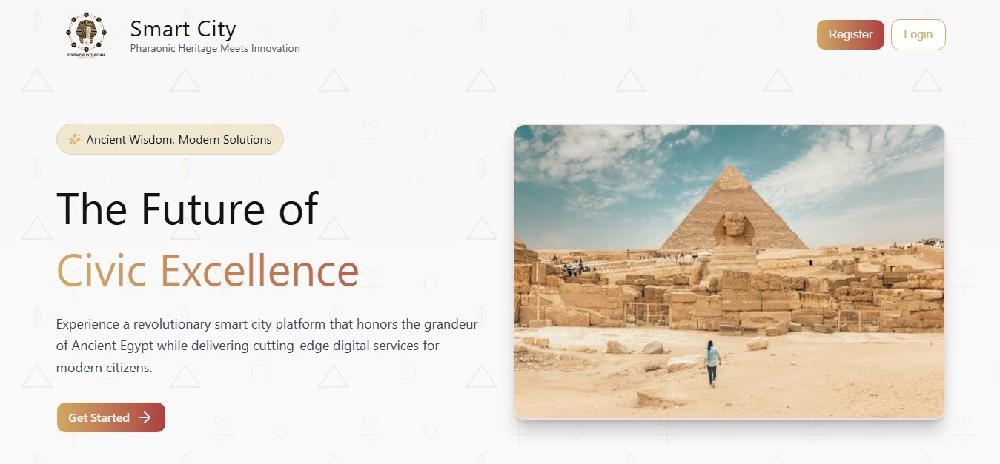

# 🏙️ Smart City System

Smart City System is a modern web-based platform designed to improve communication between citizens and city administration by centralizing essential city services into a single, user-friendly system.

The platform provides two main interfaces:
- **Citizen Portal**
- **Admin Dashboard**

It was developed as a **graduation project** under the **Digital Egypt Pioneers Initiative (DEPI)**.

---

## 🚀 Live Demo
🌐 Website:  
https://smartcitywebsite.runasp.net/

🔌 API Documentation (Swagger):  
http://smartcity.tryasp.net/swagger/index.html

🎨 UI/UX Design (Figma):  
https://barn-wise-59324304.figma.site/

---

## 🔐 Try the Admin Experience
Use the following demo credentials to explore the admin dashboard:

- **National ID:** 20304020304050  
- **Password:** Admin123  

---

> Homepage Preview  
<!-- Replace the image path with your actual screenshot -->


---

## 📌 System Overview

### 👤 Citizen Features
- Submit complaints and suggestions
- Track ticket status
- View billing and utilities
- Receive real-time notifications
- Follow updates through a simple and intuitive user journey

### 🛠️ Admin Features
- Dashboard with system statistics and insights
- User management and monitoring
- Full control over complaints and suggestions lifecycle
- Ticket status management
- Notification system to communicate with citizens
- Data-driven visibility to support decision-making

---

## 🧩 Frontend Responsibilities
The frontend focuses on delivering a clean, responsive, and scalable user experience:

- UI design implementation from scratch
- Responsive layout using mobile-first approach
- Component-based architecture with React
- API integration and authentication handling
- Performance optimization
- Smooth animations and transitions
- Consistent Egyptian-inspired visual identity

---

## 🛠️ Technologies Used

### Frontend
- **React**
- **Context API**
- **TailwindCSS**
- **Framer Motion**
- **Axios**
- **React Query**
- **Lucide React**
- **React Toastify**
- **SweetAlert2**

### Backend
- RESTful APIs
- JWT Authentication
- Swagger for API documentation

---

## 🔄 API Integration
- All API endpoints are documented using **Swagger**
- Axios is used for HTTP communication
- Interceptors handle authentication tokens and error responses

API Docs:  
http://smartcity.tryasp.net/swagger/index.html

---

## 📈 Key Highlights
- Fully responsive design
- Clean and intuitive UX
- Role-based access (Citizen / Admin)
- Real-time notifications
- Scalable component structure
- Performance-optimized frontend

---

## 📦 Installation & Setup

```bash
# Clone the repository
git clone https://github.com/a7medsobih/Smart-City.git

# Navigate to project directory
cd Smart-City

# Install dependencies
npm install

# Run the project
npm run dev


